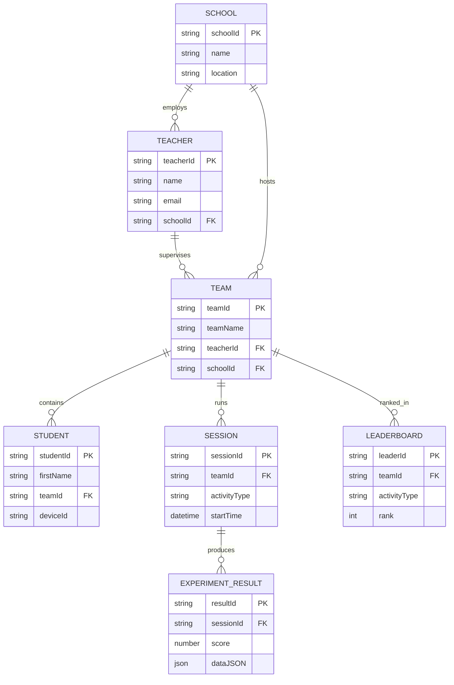

# Entity–relationship model — STEMM Lab

_Originally produced as **Assessment 1**, submitted **30 March 2026**. Figure 1 in the PDF shows the full ERD diagram; Table 2 entity descriptions are reproduced below._

## Mermaid ER diagram

## Entity descriptions (Table 2)

| Entity               | Description                                    | Key attributes                                 |
| -------------------- | ---------------------------------------------- | ---------------------------------------------- |
| **School**           | Educational institution using the app          | `SchoolID`, Name, Location                     |
| **Teacher**          | Supervising staff per session                  | `TeacherID`, Name, Email, `SchoolID`           |
| **Team**             | Group of students working together             | `TeamID`, TeamName, `TeacherID`, `SchoolID`    |
| **Student**          | Individual participant (first name only in UI) | `StudentID`, FirstName, `TeamID`, DeviceID     |
| **Session**          | Single run of one experiment                   | `SessionID`, `TeamID`, ActivityType, StartTime |
| **ExperimentResult** | Measured data from one session                 | `ResultID`, `SessionID`, Score, DataJSON       |
| **Leaderboard**      | Global rankings per activity                   | `LeaderID`, `TeamID`, ActivityType, Rank       |

## Firestore collection paths (implementation mapping)

Denormalised flat collections keep queries simple for classroom-scale data:

- `schools/{schoolId}`
- `schools/{schoolId}/teachers/{teacherId}`
- `schools/{schoolId}/teams/{teamId}`
- `schools/{schoolId}/teams/{teamId}/students/{studentId}`
- `sessions/{sessionId}` — doc fields: `teamId`, `schoolId`, `activityType`, `startTime`, `createdAt`
- `sessions/{sessionId}/results/{resultId}` — `score`, `data` (map), `submittedAt`
- `leaderboards/{activityType}/entries/{teamId}` — `rank`, `score`, `updatedAt`

_Client apps also mirror hot paths in **SQLite** (`teams`, `students`, `sessions`, `experiment_results`, `outbox`) for offline-first sync._
