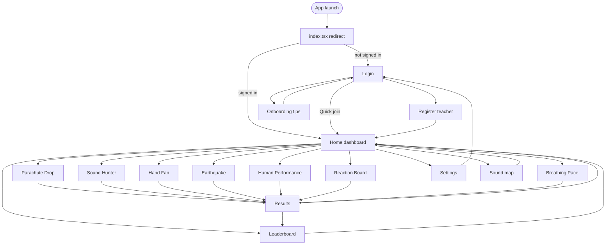

# Screen flow → Expo Router paths (A1)

STEMM Lab navigation derived from Assessment 1 user flow. Each row has a **wireframe asset** in [`wireframes/`](./wireframes/) and a matching **Expo Router** file under `app/`.

## Wireframe ↔ route mapping

| # | Wireframe file | Screen (A1) | Expo Router path | Notes |
|---|----------------|-------------|------------------|-------|
| 1 | `login.png` | Login / quick join | `app/(auth)/login.tsx` | Anonymous + teacher email |
| 2 | `register.png` | Teacher register | `app/(auth)/register.tsx` | Create email account |
| 3 | `onboarding.png` | Onboarding tips | `app/(auth)/onboarding.tsx` | First-run guidance |
| 4 | `home.png` | Home dashboard + activity picker | `app/(tabs)/index.tsx` | Activity buttons on dashboard |
| 5 | `parachute.png` | Parachute Drop | `app/activity/parachute.tsx` | Accel + g-force |
| 6 | `sound.png` | Sound Pollution Hunter | `app/activity/sound.tsx` | Mic + GPS + map preview |
| 7 | `handfan.png` | Hand Fan | `app/activity/handfan.tsx` | Camera / bend angle MVP |
| 8 | `earthquake.png` | Earthquake Structure | `app/activity/earthquake.tsx` | Vibration + haptics |
| 9 | `humanperf.png` | Human Performance Lab | `app/activity/humanperf.tsx` | Gyro smoothness |
| 10 | `reaction.png` | Reaction Board | `app/activity/reaction.tsx` | Reaction + trace |
| 11 | `breathing.png` | Breathing Pace Trainer | `app/activity/breathing.tsx` | Chest Z accel stub (Sprint 3 polish) |
| 12 | `results.png` | Session results | `app/results/[sessionId].tsx` | Score + sync status |
| 13 | `leaderboard.png` | Leaderboard | `app/(tabs)/leaderboard.tsx` | Live Firestore ranks |
| 14 | `settings.png` | Settings | `app/(tabs)/settings.tsx` | Theme, grade, sign out |
| 15 | `sound-map.png` | Sound samples map | `app/results/sound-map.tsx` | Secondary map view |

**Entry redirect:** `app/index.tsx` → `/(auth)/login` or `/(tabs)` based on auth.

**Dev spikes (not A1 wireframes):** `app/_spikes/*` — see [`feature-spikes.md`](./feature-spikes.md).

## A1 user-flow (Mermaid)

Renders on GitHub with the built-in Mermaid extension (no extra plugins).

## Layout groups (Expo Router)

| Group | Path prefix | Purpose |
|-------|-------------|---------|
| Root | `app/_layout.tsx` | Migrations, sync, notifications |
| Auth | `app/(auth)/` | Login, register, onboarding |
| Tabs | `app/(tabs)/` | Home, leaderboard, settings |
| Activities | `app/activity/` | Seven experiment screens |
| Results | `app/results/` | Dynamic session + sound map |

## Wireframe assets

PNG files live in [`docs/sprint-2/wireframes/`](./wireframes/). Minimum width **1080px** (portrait 1080×1920) for LMS / marker review. Replace placeholders with exported A1 art when available.
