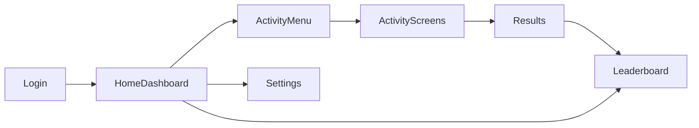

# Screen flow → Expo Router paths

| Wireframe / screen (A1)      | Route |
|-----------------------------|-------|
| Login / Splash              | `app/(auth)/login.tsx`, `app/(auth)/onboarding.tsx` |
| Home Dashboard              | `app/(tabs)/index.tsx` |
| Activity Selection          | embedded in Home (activity buttons) |
| Parachute Drop              | `app/activity/parachute.tsx` |
| Sound Polluter Hunter       | `app/activity/sound.tsx` |
| Hand Fan                    | `app/activity/handfan.tsx` |
| Earthquake / Vibration      | `app/activity/earthquake.tsx` |
| Human Performance Lab       | `app/activity/humanperf.tsx` |
| Reaction Board              | `app/activity/reaction.tsx` |
| Breathing Pace              | `app/activity/breathing.tsx` |
| Results                     | `app/results/[sessionId].tsx` |
| Leaderboard                 | `app/(tabs)/leaderboard.tsx` |
| Settings                    | `app/(tabs)/settings.tsx` |
| Sound map (secondary)       | `app/results/sound-map.tsx` |

## Navigation flow (mermaid)

Export PNG wireframes from A1 PDF into `docs/sprint-2/wireframes/` when assets are available (`home.png`, `login.png`, etc.).
