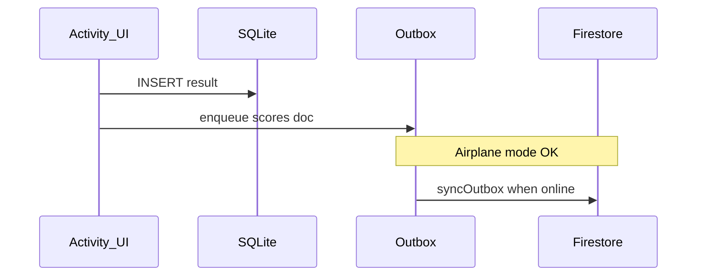

# Sprint 3 services overview

- **Auth** — `services/auth.ts` (Firebase JS `getAuth`).
- **SQLite** — `services/db/sqlite.ts` + migrations for teams/results/sessions/outbox.
- **Firestore** — `services/firestore.ts` with `writeSessionOptimistic` + `syncOutbox`.
- **Background** — `services/tasks.ts` registers `BG_SYNC_OUTBOX`.
- **Notifications** — `services/notifications.ts` (daily streak, rank-up stub).

## Offline-first (Mermaid)

