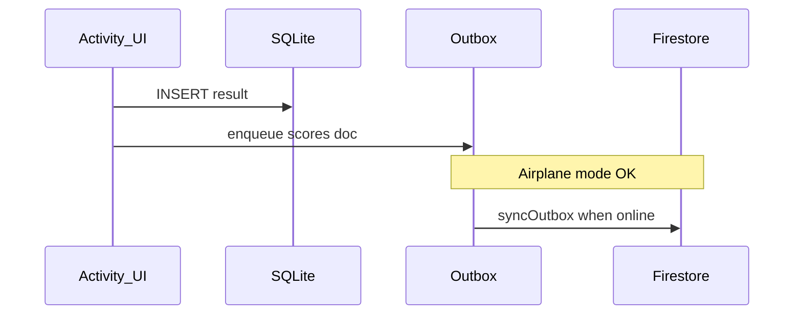

# Sprint 3 services overview

- **Auth** — `services/auth.ts` (Firebase JS `getAuth`).
- **Firestore** — `services/firestore.ts` with `writeSessionOptimistic` + `syncOutbox`.
- **Background** — `services/tasks.ts` registers `BG_SYNC_OUTBOX`.
- **Notifications** — `services/notifications.ts` (daily streak, rank-up stub).

## SQLite (`services/db/sqlite.ts`)

Migrations run via `runMigrations()` (call once at app start, e.g. root layout):

| File | Purpose |
|------|---------|
| `migrations/001_schema.sql` | Tables: `teams`, `students`, `sessions`, `experiment_results`, `outbox`, `schema_migrations` |
| `migrations/002_indexes.sql` | Indexes on foreign keys, activity type, sync flag, outbox time |

Each DAO is typed and exposes **`insert`**, **`update`**, **`findById`**, **`findAll`**:

| Export | Row type | `findById` key |
|--------|----------|----------------|
| `teamsDao` | `Team` `{ id, name }` | `string` |
| `studentsDao` | `Student` `{ id, firstName, teamId }` | `string` |
| `sessionsDao` | `Session` `{ id, teamId, activityType, startTime }` | `string` |
| `resultsDao` | `ExperimentResult` `{ id, sessionId, activityType, score, dataJson, synced }` | `string` |
| `outboxDao` | `OutboxRow` `{ id, path, payload, createdAt }` — insert accepts `OutboxInsert` (no `id`) | `number` |

Legacy helpers (used by Firestore sync): `insertOutbox`, `getAllOutbox`, `deleteOutboxIds`, `markResultSynced`.

Tests: `__tests__/sqlite.test.ts` — round-trip one row per DAO + fresh migration for `002_indexes`.

## Offline-first (Mermaid)

